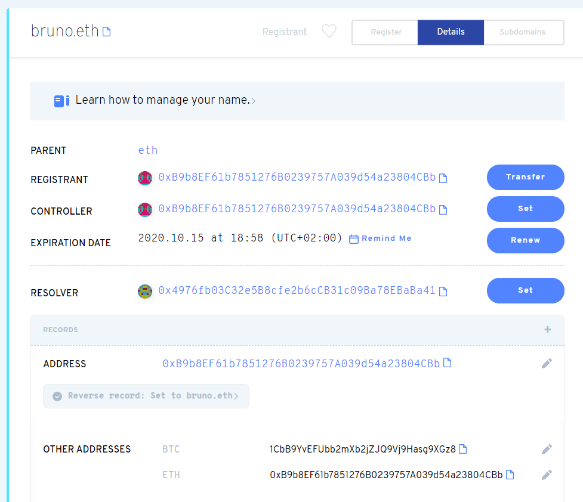
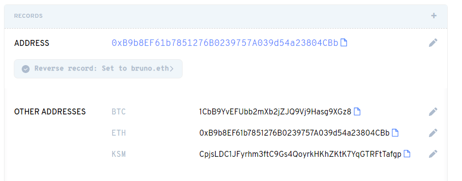

ENS (Ethereum Name Service) is a distributed and open system of smart contracts on the 
Ethereum blockchain which allows users to claim domain names like `bruno.eth`. 

The ENS is a domain that is equivalent to a DNS (Domain Name System) domain. 
Instead, it offers a decentralized and secure way to translate text via smart contracts.
Supporting wallets can then allow senders to input ENS domains instead of long and unwieldy 
addresses. This prevents phishing, fraud, typos, and adds a
layer of usability on top of the regular wallet user experience.

> Note: You will need an ENS name and an Ethereum account with some ether in it to follow along with
> this guide. To register an ENS name, visit the [ENS App](https://app.ens.domains) or any number of
> subdomain registrars like [Nameth](https://nameth.io). Note that if you're using an older ENS
> name, you should make sure you're using the
> [new resolver](https://medium.com/the-ethereum-name-service/ens-registry-migration-is-over-now-what-a-few-things-to-know-fb05f921872a).
> Visiting the ENS App will warn you about this if not. You will also need some way to use your
> Ethereum address - following this guide on a personal computer is recommended. Wallets like
> [Frame](https://frame.sh/) and [Metamask](https://metamask.io) are safe and will make interacting
> with the Ethereum blockchain through your browser very easy.

Despite living on the Ethereum blockchain, the ENS system has multi-chain support. In this guide,
you'll go through the process of adding a KSM and DOT address to ENS. We cover both KSM and DOT to
show two different approaches.

> Note: DOT can currently only be added using the Resolver method. KSM can be added through both
> methods are described below.

This guide is also available in video format [on Youtube](https://youtu.be/XKjZk-5_mQc).

## Adding via the UI

The [ENS App](https://app.ens.domains) allows an ENS domain owner to inspect all records bound to
the domain, and to add new ones.

In the example above, the domain `bruno.eth` has an Ethereum and a Bitcoin address attached. Let's
attach a KSM account. First, click the `[+]` icon in the Records tab.

Then, pick "Other Addresses", "KSM", and input the Kusama address:

After clicking Save, your Ethereum wallet will ask you to confirm a transaction. Once processed, the
record will show up on the domain's page:

The same process applies to adding your DOT address.

Once the transaction is confirmed, your address will be bound to your ENS domain.

### Wallet Support

There is no wallet support for ENS names for either KSM or DOT at this time, but the crypto
accounting and portfolio application [Rotki](https://rotki.com/) does support KSM ENS resolution.

### Relevant links

- [ENS docs](https://docs.ens.domains/)
- [ENS Multi-chain announcement](https://medium.com/the-ethereum-name-service/ens-launches-multi-coin-support-15-wallets-to-integrate-92518ab20599)
- [Address encoder](https://github.com/ensdomains/address-encoder)
- [Namehash calculator](https://swolfeyes.github.io/ethereum-namehash-calculator/)
- [Address to pubkey converter](https://www.shawntabrizi.com/substrate-js-utilities/)
