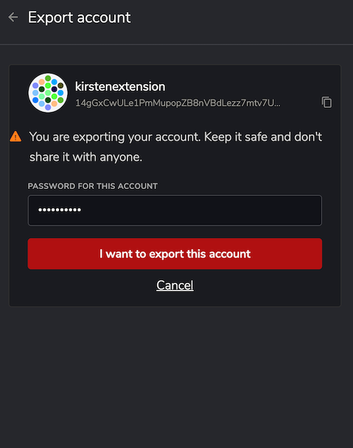
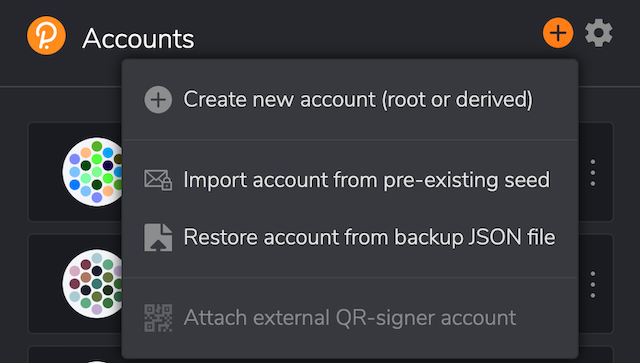
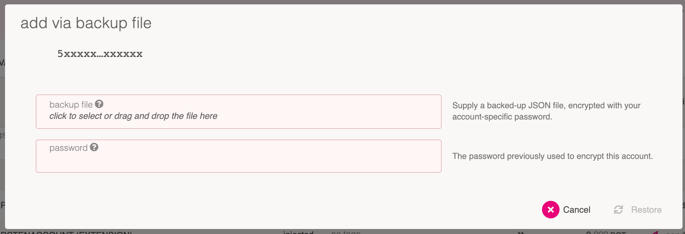

In the case that your Polkadot account needs to backed up and later restored, there are simple ways
to take care of this in Polkadot{.js} Browser Plugin, Polkadot{.js} Apps, and Parity Signer. Note that in
order to recover an account, it is necessary that an account is created according to the
instructions [here](learn-account-generation).

## Polkadot{.js} Browser Plugin

For using the Polkadot{.js} browser plugin, restoring an account is simple. Let's start off by
heading over to the extension and selecting the desired account to restore. Click on the three dots
beside the address to open up a settings tab.

From here, we will be selecting the Export Account button, which will then ask you for the password
for that specific account. Once you enter the password, the browser will automatically download a
`.json` file that will hold all the account restoration details that will be used when you restore
your account. This part is _very important_.

Now, onto restoring the account. In Polkadot{.js} browser plugin, let's click on the + button at the
top. This will open up a tab with many choices listed, select "Restore account from backup JSON
file". This will then prompt you for the `.json` file which was download earlier and the password
for that account.

Once these are filled out, and the "Restore" button has been pressed, you'll be taken back to the
main page of the plugin. There listed will be your restored account.

## Polkadot{.js}

If you're using the main Polkadot{.js} UI, restoring an account will feel similar to restoring an
account on Polkadot{.js} browser plugin. The first step is to click on the "Restore JSON" button.

Now that's completed, it's time to restore the account. On the Polkadot accounts page, click on the
"Restore JSON" button, which will let you upload your `.json` file that you downloaded and enter
your password for that account. This `.json` file holds all relevant data about the account to be
used in account restoration.

Once you've pressed the "Restore" button, you should see a green notification letting you know that
your account has been restored.

### Using an existing Mnemonic Seed to restore an Account

If you've already created an account but are looking to have it restored, you can do that by using
the Polkadot{.js} UI and the existing mnemonic seed.

To start, you'll need to open up the [Polkadot{.js} UI](https://polkadot.js.org/apps) and head over
to the accounts tab. Click on the "Add Account" button, and fill out with the prompted details: a
name for the account, a password, and be sure to replace the generated mnemonic seed with your
_existing seed_. Note here that when you replace the generated mnemonic seed with your existing one,
you aren't actually creating a new account, rather adding that account onto the Polkadot{.js} UI. It
is also important to note that the name and the password of this added account can be set to
whatever you'd like, it does not need to be that specific accounts name and password when created.

Once those details have been filled in, you will need to click on the "Save" button. This will
prompt a screen to appear. To back up your existing account, press on the "Create and backup
account" button. This will download the `.json` file which contains the data to be used in account
restoration.

Now you've successfully restored and backed up your account using its mnemonic seed.

## Parity Signer

If you've already created an account with Parity Signer or any other wallet, you can recover that
account on Parity Signer.

On Parity Signer, click on the top right user icon on the screen. Proceed to "+ Add Identity". On
this screen, tap on the "recover existing identity" button.

Enter in the identity name and the mnemonic seed phrase from the account you'd like to restore
respectively.

Set an identity PIN that will be used to unlock this account when you need to.

The identity has now been recovered and you can select a network to create the first account.
