Polkadot provides a naming system that allows participants to add personal information to their
on-chain account and subsequently ask for verification of this information by
[registrars](#registrars).

## Setting an Identity

Users can set an identity by registering through default fields such as legal name, display name,
website, Twitter handle, Riot handle, etc. along with some extra, custom fields for which they would
like attestations (see [Judgements](#judgements)).

Users must reserve funds in a bond to store their information on chain:
{{ identity_reserve_funds }}, and {{ identity_field_funds }} per each field beyond the legal name.
These funds are _locked_, not spent - they are returned when the identity is cleared. 

These amounts can also be extracted by querying constants through
the [Chain state constants](https://polkadot.js.org/apps/#/chainstate/constants) tab on polkadot.js/apps. 

First, select `identity` as the `selected constant query`. 

Then on the right-hand side, you can select the constants that you would like to view and add them onto the webpage by clicking the "plus" icon at the end of the bar.

Each field can
store up to 32 bytes of information, so the data must be less than that. When inputting the data
manually through the [Extrinsics UI](https://polkadot.js.org/apps/#/extrinsics), a
[UTF8 to bytes](https://onlineutf8tools.com/convert-utf8-to-bytes) converter can help.

The easiest way to add the built-in fields is to click the gear icon next to your account and select
"Set on-chain identity".

A popup will appear, offering the default fields.

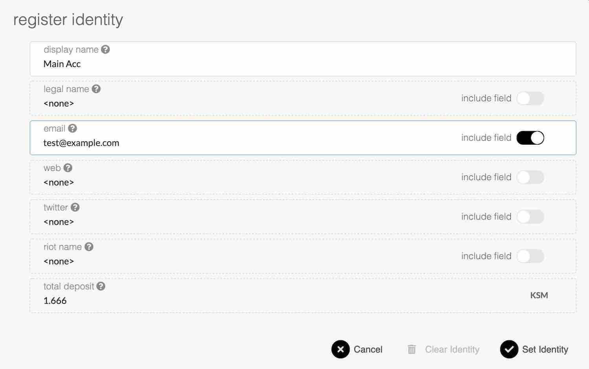

To add custom fields beyond the default ones, use the Extrinsics UI to submit a raw transaction by
first clicking "Add Item" and adding any field name you like. The example below adds a field
`steam`, which is a user's [Steam](https://store.steampowered.com) username. The first value is the
field name in bytes ("steam") and the second is the account name in bytes ("theswader"). The display
name also has to be provided, otherwise, the Identity pallet would consider it wiped if we submitted
it with the "None" option still selected. That is to say, every time you make a change to your
identity values, you need to re-submit the entire set of fields: the write operation is always
"overwrite", never "append".

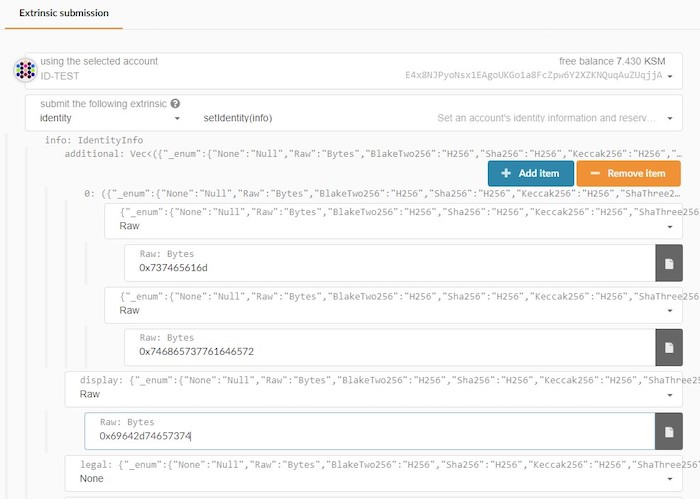

Note that custom fields are not shown in the UI by default:

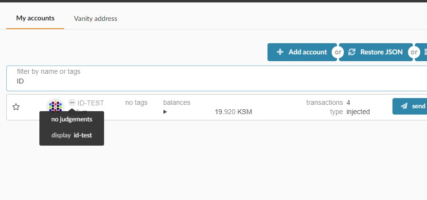

The rendering of such custom values is, ultimately, up to the UI/dapp makers. In the case of
PolkadotJS, the team prefers to only show official fields for now. If you want to check that the
values are still stored, use the [Chain State UI](https://polkadot.js.org/apps/#/chainstate) to
query the active account's identity info:

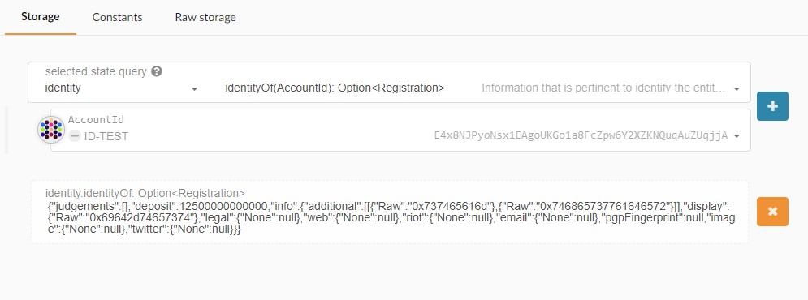

It is up to your own UI or dapp to then do with this data as it pleases. The data will remain
available for querying via the Polkadot API, so you don't have to rely on the PolkadotJS UI.

You can have a maximum of 100 custom fields.

### Format Caveat

Please note the following caveat: because the fields support different formats, from raw bytes to
various hashes, a UI has no way of telling how to encode a given field it encounters. The PolkadotJS
UI currently encodes the raw bytes it encounters as UTF8 strings, which makes these values readable
on-screen. However, given that there are no restrictions on the values that can be placed into these
fields, a different UI may interpret them as, for example, IPFS hashes or encoded bitmaps. This
means any field stored as raw bytes will become unreadable by that specific UI. As field standards
crystallize, things will become easier to use but for now, every custom implementation of displaying
user information will likely have to make a conscious decision on the approach to take, or support
multiple formats and then attempt multiple encodings until the output makes sense.

## Registrars

Registrars can set a fee for their services and limit their attestation to certain fields. For
example, a registrar could charge 1 DOT to verify one's legal name, email, and GPG key. When a user
requests judgement, they will pay this fee to the registrar who provides the judgement on those
claims. Users set a maximum fee they are willing to pay and only registrars below this amount would
provide judgement.

### Becoming a registrar

To become a registrar, submit a pre-image and proposal into Democracy, then wait for people to vote
on it. For best results, write a post about your identity and intentions beforehand, and once the
proposal is in the queue ask people to second it so that it gets ahead in the referendum queue.

Here's how to submit a proposal to become a registrar:

Go to the Democracy tab, select "Submit preimage", and input the information for this motion -
notably which account you're nominating to be a registrar in the `identity.setRegistrar` function.

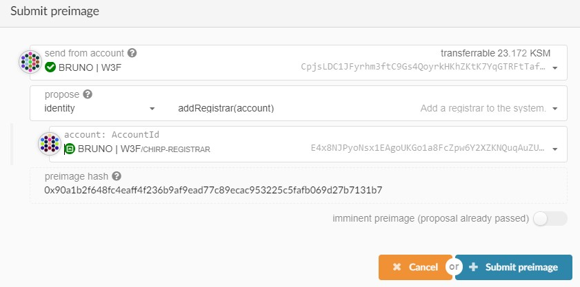

Copy the preimage hash. In the above image, that's
`0x90a1b2f648fc4eaff4f236b9af9ead77c89ecac953225c5fafb069d27b7131b7`. Submit the preimage by signing
a transaction.

Next, select "Submit Proposal" and enter the previously copied preimage hash. The `locked balance`
field needs to be at least {{ identity_reserve_funds }} KSM. You can find out the minimum by
querying the chain state under [Chain State](https://polkadot.js.org/apps/#/chainstate) -> Constants
-> democracy -> minimumDeposit.

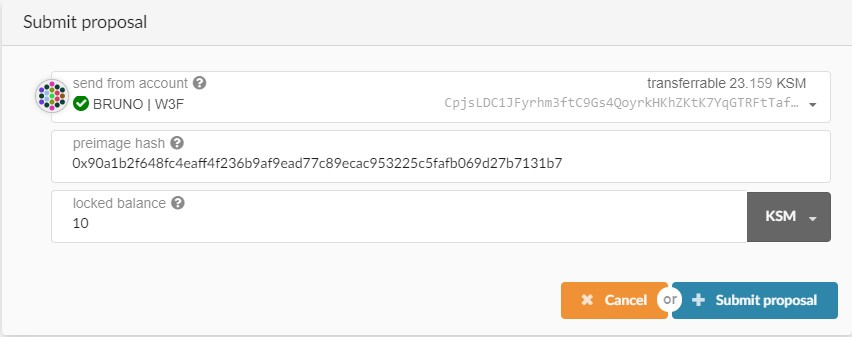

At this point, DOT holders can second the motion. With enough seconds, the motion will become a
referendum, which is then voted on. If it passes, users will be able to request judgement from this
registrar.

## Judgements

After a user injects their information on chain, they can request judgement from a registrar. Users
declare a maximum fee that they are willing to pay for judgement, and registrars whose fee is below
that amount can provide a judgement.

When a registrar provides judgement, they can select up to six levels of confidence in their
attestation:

- Unknown: The default value, no judgement made yet.
- Reasonable: The data appears reasonable, but no in-depth checks (e.g. formal KYC process) were
  performed.
- Known Good: The registrar has certified that the information is correct.
- Out of Date: The information used to be good, but is now out of date.
- Low Quality: The information is low quality or imprecise, but can be fixed with an update.
- Erroneous: The information is erroneous and may indicate malicious intent.

A seventh state, "fee paid", is for when a user has requested judgement and it is in progress.
Information that is in this state or "erroneous" is "sticky" and cannot be modified; it can only be
removed by complete removal of the identity.

Registrars gain trust by performing proper due diligence and would presumably be replaced for
issuing faulty judgements.

To be judged after submitting your identity information, go to the
["Extrinsics UI"](https://polkadot.js.org/apps/#/extrinsics) and select the `identity` pallet, then
`requestJudgement`. For the `reg_index` put the index of the registrar you want to be judged by, and
for the `max_fee` put the maximum you're willing to pay for these confirmations.

If you don't know which registrar to pick, first check the available registrars by going to
["Chain State UI"]() and selecting `identity.registrars()` to get the full list.

## Cancelling Judgements

You may decide that you do not want to be judged by a registrar (for instance, because you realize
you entered incorrect data or selected the wrong registrar). In this case, after submitting the
request for judgement but before your identity has been judged, you can issue a call to cancel the
judgement using an extrinsic.

To do this, first, go to the ["Extrinsics UI"](https://polkadot.js.org/apps/#/extrinsics) and select
the `identity` pallet, then `cancelRequest`. Ensure that you are calling this from the correct
account (the one for which you initially requested judgement). For the `reg_index`, put the index of
the registrar from which you requested judgement.

Submit the transaction, and the requested judgement will be cancelled.

### Kusama Registrars

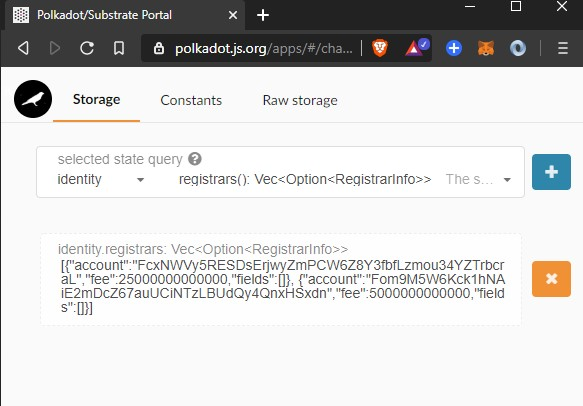

The image above reveals there are two registrars on Kusama:

- Registrar 0, FcxNWVy5RESDsErjwyZmPCW6Z8Y3fbfLzmou34YZTrbcraL
- Registrar 1, Fom9M5W6Kck1hNAiE2mDcZ67auUCiNTzLBUdQy4QnxHSxdn

To find out how to contact the registrar after the application for judgement or to learn who they
are, we can check their identity by adding them to our Address Book. Their identity will be
automatically loaded.

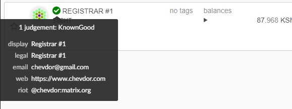

### Polkadot Registrars

On Polkadot there are two registrars:

- Web3 Foundation is registrar #0. The W3F registrar service is available on the Kusama at the
  moment, follow the guide written [here](learn-registrar) on how to use it. The service will be
  available on the Polkadot shortly.
- Chevdor is registrar #1.

### Requesting Judgement

Requesting judement follows the same process regardless of whether you're on the Kusama or Polkadot
networks. Select one of the registrars from the query you made above.

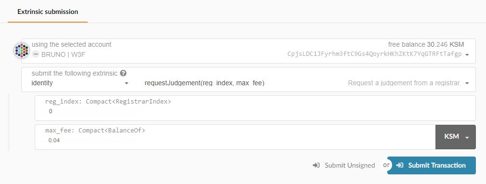

This will make your identity go from unjudged:

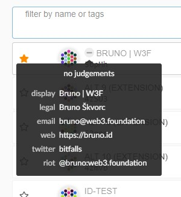

To "waiting":

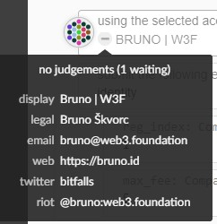

At this point, direct contact with the registrar is required - the contact info is in their identity
as shown above. Each registrar will have their own set of procedures to verify your identity and
values, and only once you've satisfied their requirements will the process continue.

Once the registrar has confirmed the identity, a green checkmark should appear next to your account
name with the appropriate confidence level:

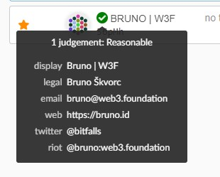

_Note that changing even a single field's value after you've been verified will un-verify your
account and you will need to start the judgement process anew. However, you can still change fields
while the judgement is going on - it's up to the registrar to keep an eye on the changes._

## Sub Accounts

Users can also link accounts by setting "sub accounts", each with its own identity, under a primary
account. The system reserves a bond for each sub account. An example of how you might use this would
be a validation company running multiple validators. A single entity, "My Staking Company", could
register multiple sub accounts that represent the [Stash accounts](learn-keys) of each of their
validators.

An account can have a maximum of 100 sub-accounts.

To register a sub-account on an existing account, you must currently use the
[Extrinsics UI](https://polkadot.js.org/apps/#/extrinsics). There, select the identity pallet, then
`setSubs` as the function to use. Click "Add Item" for every child account you want to add to the
parent sender account. The value to put into the Data field of each parent is the optional name of
the sub-account. If omitted, the sub-account will inherit the parent's name and be displayed as
`parent/parent` instead of `parent/child`.

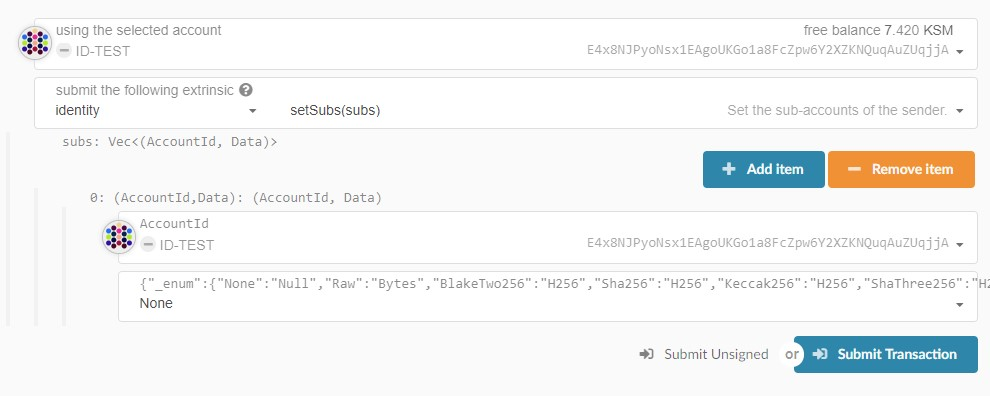

Note that a deposit of {{ identity_sub_reserve_funds }} is required for every sub-account.

You can use [polkadot.js/apps](https://polkadot.js.org/apps/?rpc=wss%3A%2F%2Frpc.polkadot.io#/chainstate/constants) again to verify this amount by querying the `identity.subAccountDeposit` constant.

## Clearing and Killing an Identity

**Clearing:** Users can clear their identity information and have their deposit returned. Clearing
an identity also clears all sub accounts and returns their deposits.

To clear an identity:

1. Navigate to the [Accounts UI](https://polkadot.js.org/apps/#/accounts).
2. Click the three dots corresponding to the account you want to clear and select 'Set on-chain
   identity'.
3. Select 'Clear Identity', and sign and submit the transaction.

**Killing:** The Council can kill an identity that it deems erroneous. This results in a slash of
the deposit.
